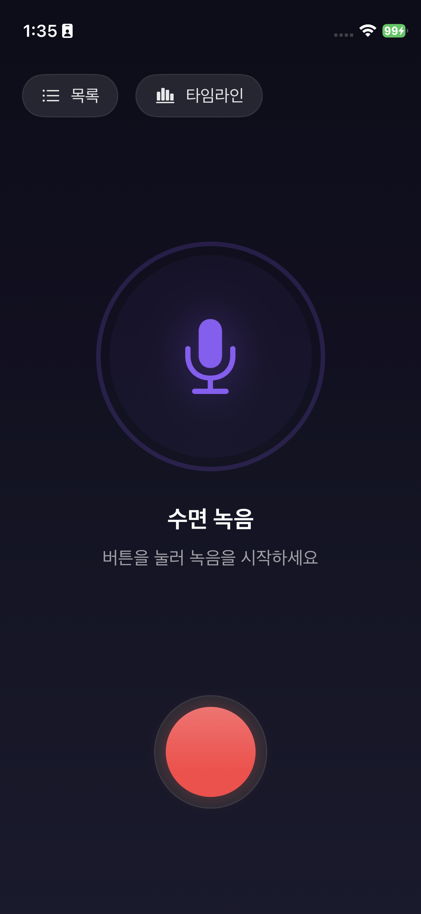
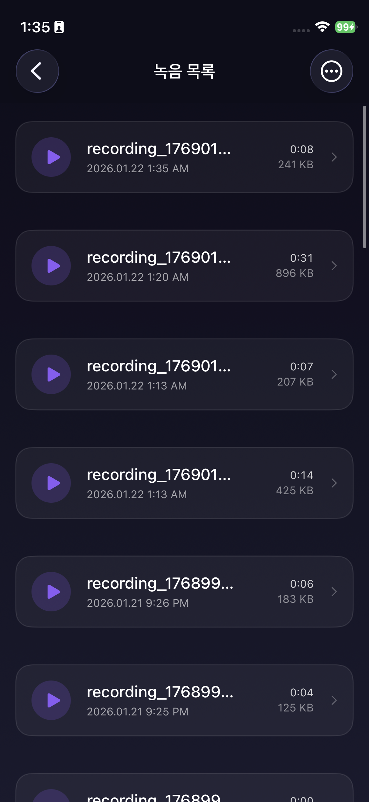
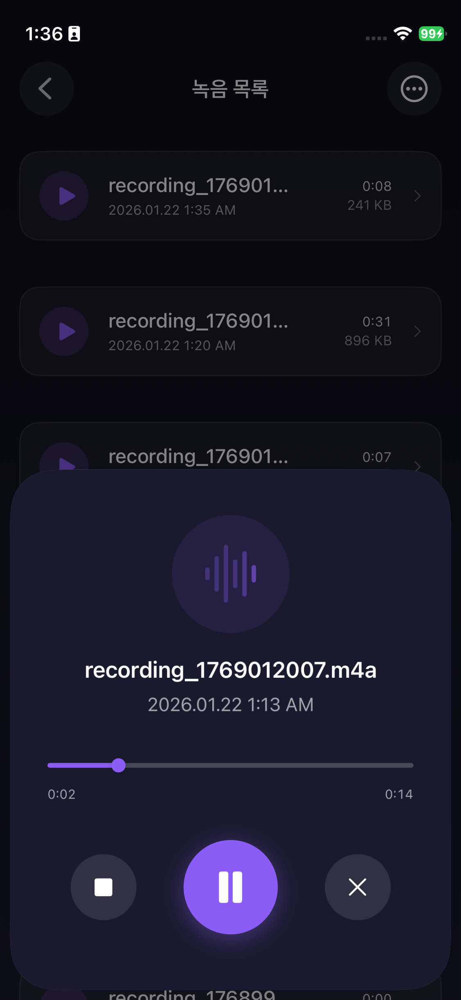
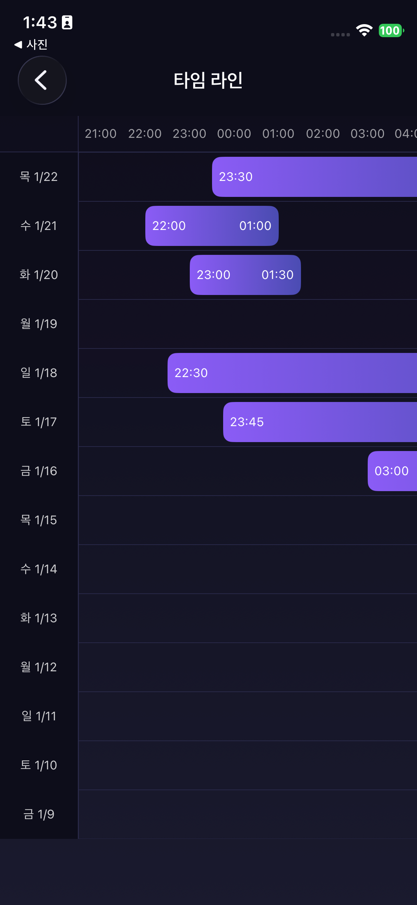
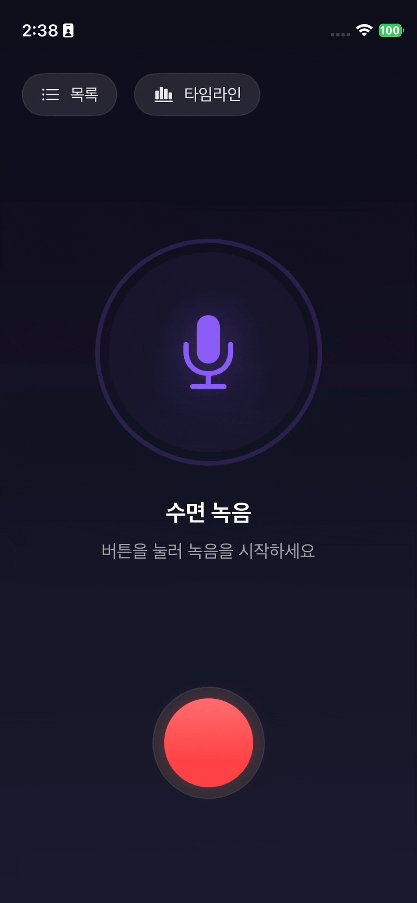
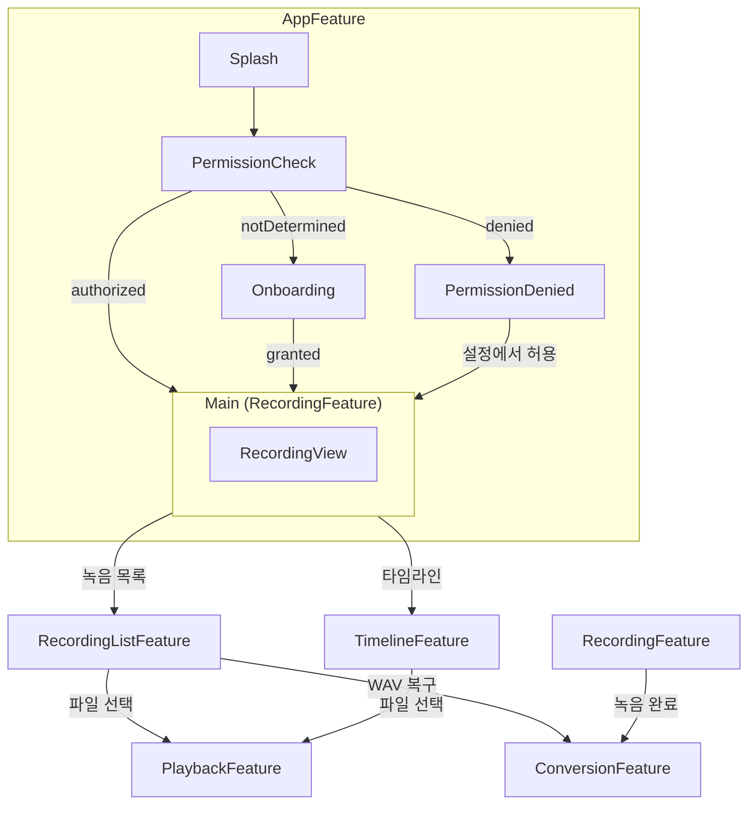
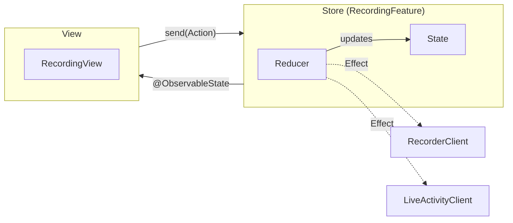

# BSleep

## 목차
1. [개요](#1-개요)
2. [스크린샷](#2-스크린샷)
3. [주요 기능](#3-주요-기능)
4. [기술 스택](#4-기술-스택)
5. [폴더 구조](#5-폴더-구조)
6. [데모 영상](#6-데모-영상)
7. [다이어그램](#7-다이어그램)
8. [고민한 점](#8-고민한-점)
9. [추후 구현하고 싶은 것](#9-추후-구현하고-싶은-것)

---
## 1. 개요
- 설명: 수면을 기록하고 녹음된 파일을 볼 수 있는 앱
- 기간: 2026.01.17 ~ 2026.01.22

## 2. 스크린샷

| 녹음 대기 | 녹음 중 | 녹음 목록 | 재생 화면 | 타임라인 |
|:---------:|:---------:|:---------:|:--------:|:---------:|
|  |  |  |  |  |


## 3. 주요 기능
### 기본 요구사항
- 수면 녹음
- 백그라운드 녹음
- 녹음 파일 재생, 일시정지, 정지
- 타임라인 뷰

### 추가 요구사항 및 예외처리
- 마이크 권한이 없는 경우 처리.
- 녹음 파일 리스트 목록 화면.
- 녹음 중에 인터럽트(전화나 시리 등)가 오면 녹음을 일시정지 하고, 인터럽트 종료시 녹음 재개.
- 녹음 중 앱 종료시, 비정상적으로 저장된 녹음 파일을 복구하기 위해 WAV 파일로 저장.
    - 비정상 종료된 WAV 파일 복구 기능
- 녹음 파일은 WAV파일도 녹음 후, 바로 M4A로 변환하여 저장.
    - M4A파일 변환 후, WAV파일 삭제.
- 아이폰에 5기가 저장공간이 없는 경우, 녹음 시작 불가.

## 4. 기술 스택
- 언어: Swift 6
- UI: SwiftUI
- 아키텍처: TCA (The Composable Architecture)
- 녹음 및 재생: AVFoundation
- 기타: WidgetKit (Live Activity), FileManager
- IDE: Antigravity
- LLM Model: Claude 4.5 Opus, Sonnet, Gemini 3.0 Pro

### TCA 사용 이유
- 단방향 데이터 흐름으로 상태 관리가 예측 가능하고 디버깅이 용이
- 각 계층을 분리하고 의존성 주입을 통해, 유지 보수 및 테스트 용이
- LLM이 잘 이해하는 아키텍처로, AI 페어 프로그래밍 시 균일한 코드 품질 유지

## 5. 폴더 구조

```
AsleepSubject/
├── AsleepSubjectApp.swift          # 앱 진입점
├── Features/                        # TCA 피처 모듈
│   ├── App/                         # 앱 루트 (권한, 네비게이션)
│   ├── Recording/                   # 녹음 화면
│   ├── RecordingList/               # 녹음 목록 화면
│   ├── Playback/                    # 재생 화면
│   ├── Timeline/                    # 타임라인 그래프
│   └── Conversion/                  # WAV→M4A 변환, WAV 복구
├── Dependencies/                    # TCA Dependency 클라이언트
│   ├── RecorderClient.swift         # 녹음 (AVAudioRecorder)
│   ├── PlayerClient.swift           # 재생 (AVAudioPlayer)
│   ├── LiveActivityClient.swift     # Dynamic Island
│   ├── AudioConverterClient.swift   # WAV→M4A 변환
│   ├── WavRecoveryClient.swift      # 손상된 WAV 복구
│   ├── RecordingStorageClient.swift # 파일 저장/로드
│   ├── PermissionClient.swift       # 마이크 권한
│   └── AppStorageClient.swift       # 저장공간 확인
├── Models/                          # 데이터 모델
│   ├── Recording.swift              # 녹음 파일 엔티티
│   ├── AudioSettings.swift          # 오디오 설정
│   └── PlaybackState.swift          # 재생 상태
├── DesignSystem/                    # 공통 UI (색상, 스타일)
└── Extensions/                      # Swift 확장
```

**구조 설명:**
- **Features/**: 각 화면별로 Feature(Reducer) + View를 함께 배치
- **Dependencies/**: 외부 의존성을 Protocol로 추상화하여 테스트 가능하게 구성
- **Models/**: Feature 간 공유되는 데이터 모델

## 6. 데모 영상

| 권한 허용 | 권한 거부 |
|:---------:|:---------:|
| 온보딩 → 권한 요청 → 허용 | 권한 거부 → 설정 유도 → 허용 |
|  |  |

| 저장공간 부족 | 인터럽트 처리 |
|:------------:|:------------:|
| 녹음 시작 → 저장공간 부족 알림 | 녹음 중 시리 호출 → 자동 재개 |
|  |  |

| 백그라운드 녹음 | 재생 |
|:--------------:|:----:|
| 백그라운드 → Live Activity 표시 | 녹음 파일 선택 → 재생 |
|  |  |

| WAV 복구 | 타임라인 |
|:--------:|:--------:|
| 비정상 종료 → 복구 → 재생 | 타임라인에서 녹음 확인 |
|  |  |

## 7. 다이어그램

### 앱 전체 흐름



**화면 흐름:**
- **앱 시작**: Splash → 권한 확인 → 상태에 따라 분기
- **메인 화면**: 녹음 기능 + 녹음 목록/타임라인 네비게이션
- **녹음 완료**: WAV → M4A 변환 (`ConversionFeature`)
- **파일 재생**: 녹음 목록에서 선택 시 `PlaybackFeature`

---

### 피처 구조도
- 예시: Recording(녹음 화면)



**흐름 설명:**
1. **View → Store**: 사용자 인터랙션 시 Action을 Store에 전달
2. **Reducer → State**: Reducer가 Action을 처리하여 State 업데이트
3. **Store → View**: `@ObservableState`를 통해 State 변경 시 View 자동 렌더링
4. **Reducer → Client** (점선): 비동기 작업(녹음, Live Activity)은 Effect를 통해 Dependency에 위임

## 8. 고민한 점
### 사용자가 녹음 중에 앱을 강제로 종료했을 때, 처리
- 처음에는 m4a로 녹음하다가, 녹음 중에 앱이 종료되면 파일이 손상될 수 있음.
- 그래서 녹음 중에 wav로 녹음하다가, 앱이 종료되면 wav 파일을 복구해서 m4a로 변환하는 방식으로 변경.

## 9. 추후 구현하고 싶은 것
- 타임라인 뷰, 핀치 줌 아웃으로 가로 너비 조절 기능
- 인터럽트 시, 녹음 파일이 여러개로 분리 되는데 한 파일로 병합하는 기능
